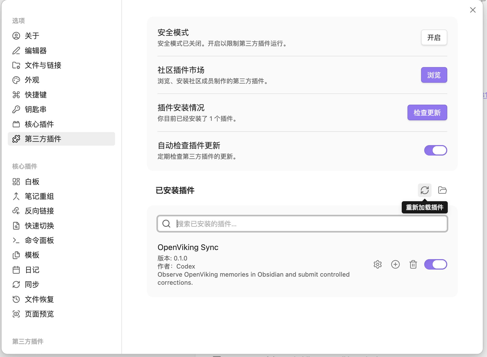
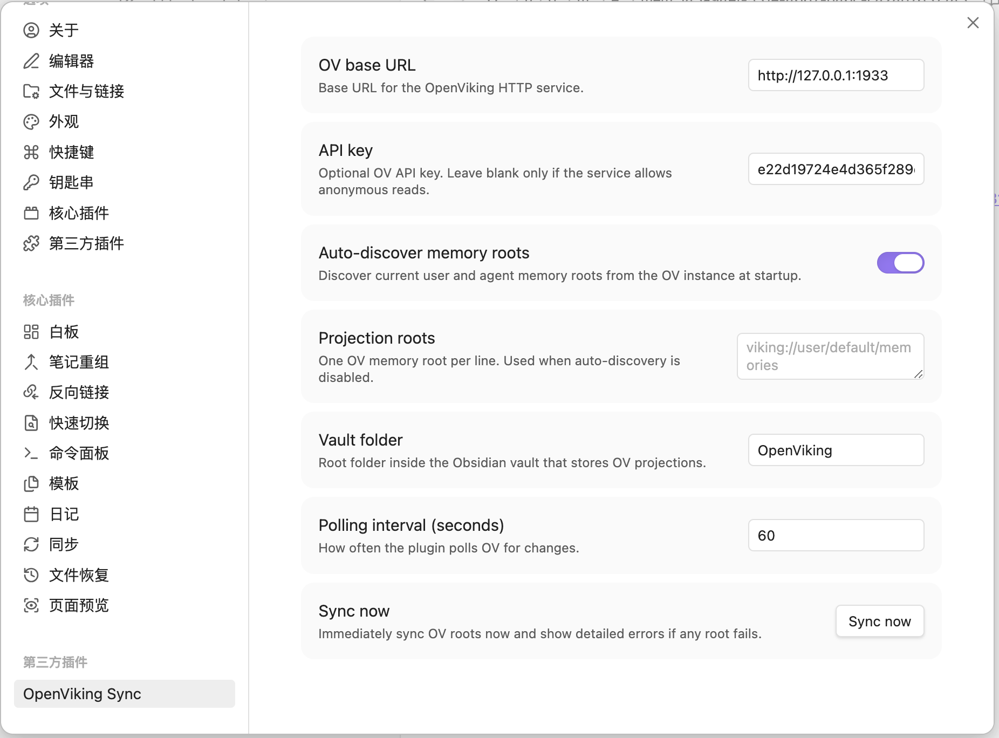
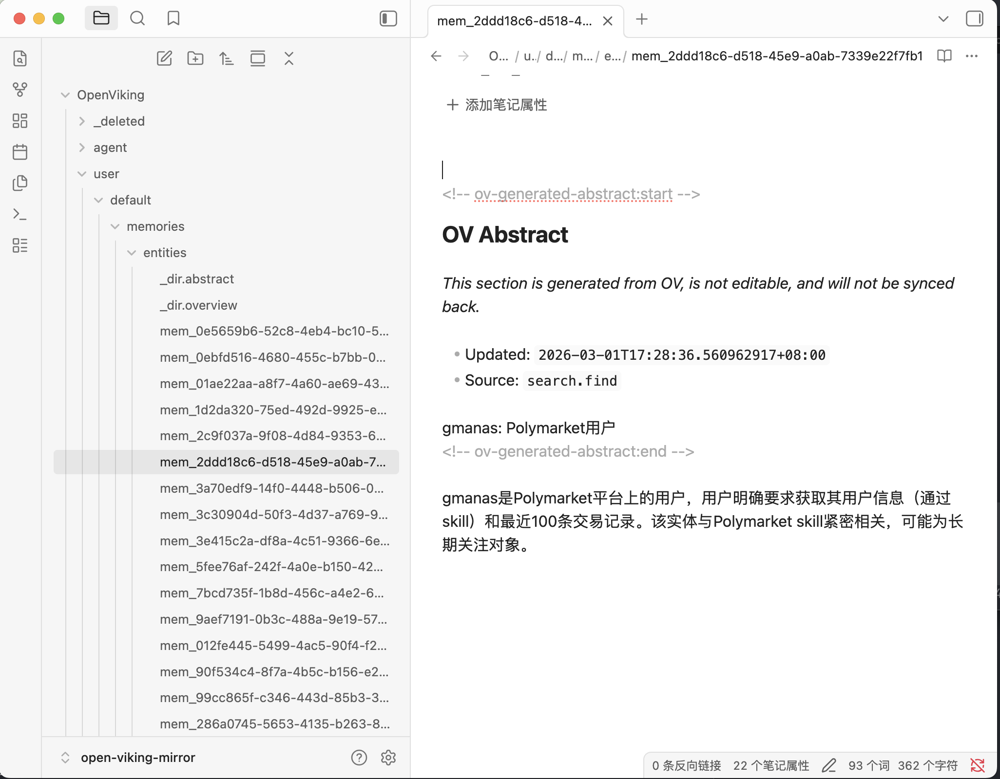

# OpenViking Sync

🌐 README:
🇺🇸 [English](../../README.md) |
🇨🇳 [简体中文](README.zh-CN.md) |
🇹🇼 [繁體中文](README.zh-TW.md) |
🇯🇵 [日本語](README.ja.md) |
🇰🇷 [한국어](README.ko.md) |
🇪🇸 [Español](README.es.md) |
🇫🇷 [Français](README.fr.md) |
🇩🇪 [Deutsch](README.de.md) |
🇮🇹 [Italiano](README.it.md) |
🇧🇷 [Português (Brasil)](README.pt-BR.md) |
🇷🇺 [Русский](README.ru.md) |
🇸🇦 [العربية](README.ar.md) |
🇮🇳 [हिन्दी](README.hi.md)

Plugin de la comunidad de Obsidian, solo para escritorio, que refleja datos de memoria de OpenViking dentro de un vault de Obsidian y envía correcciones controladas de vuelta a OpenViking.

## Funciones

- Descubre automáticamente raíces reales de memoria OpenViking como `viking://user/{space}/memories`
- Refleja resúmenes de directorio en `_dir.abstract.md` y `_dir.overview.md`
- Refleja archivos de memoria hoja como `mem_*.md` y `profile.md`
- Añade una sección `OpenViking Abstract` generada y de solo lectura en cada archivo hoja
- Restaura esa sección inmediatamente si el usuario la edita
- Detecta borradores locales solo en archivos hoja editables
- Envía correcciones mediante OpenViking session extraction y enlaza el correction URI
- Soporta UI multilingüe mediante archivos de recursos en `src/locales/`

## Estructura

```text
src/
  i18n.ts
  locales/
  main.ts
  settings.ts
  ov-client.ts
  store.ts
  projector.ts
  sync-engine.ts
  correction-engine.ts
tests/
docs/
```

## Instalación

```bash
npm install
npm run build
```

Copia `main.js` y `manifest.json` en:

```text
<Vault>/.obsidian/plugins/openviking-sync/
```



Después recarga Obsidian y habilita el plugin.

## Configuración

Valores locales recomendados:

- `OpenViking base URL`: `http://127.0.0.1:1933`
- `API key`: tu clave API de OpenViking
- `UI language`: `Auto` o cualquier idioma compatible
- `Auto-discover memory roots`: activado
- `Vault folder`: `OpenViking`
- `Polling interval`: `60`




## Desarrollo

```bash
npm run typecheck
npm test
npm run build
```



## Notas del modelo actual

- Los `L0/L1` de directorio son los resúmenes oficiales de OpenViking
- Los archivos de memoria hoja exponen un `abstract` utilizable (`L0`)
- Los archivos hoja no tienen un `L1` público y estable por archivo
- La sección generada `OpenViking Abstract` es estrictamente unidireccional: OpenViking -> Obsidian
